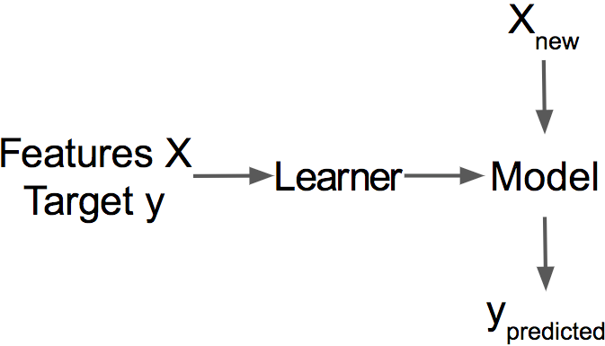

# Interpretacyjne uczenie maszynowe

dr hab. Jarosław Jasiewicz, prof. UAM
jarekj@amu.edu.pl

# Definicje

## Interpretative machine learning ma podwójne zastosowanie

interpretative: interpretacyjne

* zrozumienie modelu, głównie w celu poprawy jego działania (why)
* wykorzystanie modeli/learnerów do przybliżenia/zrozumienia złożoności świata rzeczywistego (what)

## Model i learner

**Learner** (albo induktor) to algorytm wytrenowany na danych treningowych. **Model** to algorytm używany do predykcji dla nowych danych

Klasyfikator: model/learner którego zmienna zależna jest kategoryzowana (binarna)
Regressor: model/learner którego zmienna zależna jest wartością

## Model czarnej skrzynki vs Model szklanej skrzynki

Matematyczna struktura każdego modelu może zostać ujawniona, ale nie każda może zostać zinterpretowana

Model czarnej skrzynki, to taki, którego struktura nie jest intepretowalna przez człowieka:

* sieci neuronowe
* wektory wsparcia
* random forest, xgboost

Model szlanej skrzynki, to model którego struktura jest interpretowana bezpośrednio

* modele liniowe
* modele addytywne (GAM)
* drzewa decyzyjno-regresyjne

Modele szlanej skrzynki interpretuje się bezpośrednio. Modele czarnej skrzynki interpretuje się przy pomocy metod niezależnych od modelu (**model agnostic**). Niektóre modele (random forest) mają narzędzia pozwalające wykorzystywać wewnętrzną strukturę modeli do wspomagania procesu interpretacji.

## Ograniczenia interpretacyjnego uczenia maszynowego

* Interpretowanie modeli o niskim znaczeniu (wydajności) nie ma wielkiego sensu gdyż nie przybliżają rzeczywistości
* Modele tworzone dla dobrze zbadanych problemów z reguły nie tworzą nowej wiedzy
  
# Zasięg interpretowalności

## Modele białej skrzynki

Analiza rzeczywistości poprzez tworzenie modeli wewnętrznie interpretowalnych

## Zrozumienie jak działa algorytm będący podstawą modelu

* Matematyczne podstawy działania algorytmu
* Mechanizm optymalizacji struktury wewnętrznej, funkcja celu
* Algorytmy szklanej skrzynki jako surogaty algorytmów czarnej skrzynki
* Interpretowalne elementy algorytmu (jeżeli istnieją):

Algorytmy: modele liniowe, drzewa decyzyjno-regresyjne, generalizowane modele addytywne (GAM)
Narzędzia: sklearn, matplotlib, pyGAM

## Zrozumienie jak model dokonuje predykcji, na poziomie  zmiennych

* istotność zmiennych
* zmienne skorelowane, interakcje pomiędzy zmiennymi, surogaty
* zależność pomiędzy pojedynczą z zmienną wyjaśniającą a zmienną wyjaśnianą (mechanizm ceteris paribus)
* globalne modele wyjaśniające (agnostyczne i specyficzne)

algorytmy: permutacje i kombinacje, granice decyzyjne, interakcje między zmiennymi, zależność częściowa (partial dependence), ALE (accumulated local efect)
Narzędzia: sklearn, matplotlib, alibi

## Zrozumienie pojedynczej predykcji

* dlaczego model zadział tak, w danym konretnym przypadku
* analiza przypadków odstających vs. wzorcowych
* poprawa predykcji przypadków granicznych
* wykrywanie potencjalnych problemów

algorytmy: warunkowa wartość oczekiwana (ICE), lokalne surogaty (LIME), wnioskowanie wbrew faktom, Shapely values
Narzędzia: sklearn, matplotlib, lime, alibi, SHAP, dalex

## Rozpozanie grup predykcji realizowanych w podobny sposób

* grupowanie przypadków wyjaśnianych w podobny sposób
* znajdowanie powtzrzających się wzorców wyjaśniania, wzorce jako przybliżenie rzeczywistości
* poprawa predycji poprzez dobór algorytmów do części danych

Projekt: rozpozanie wzorców predycji w danych i ich interpretacja
Narzędzia: do wyboru